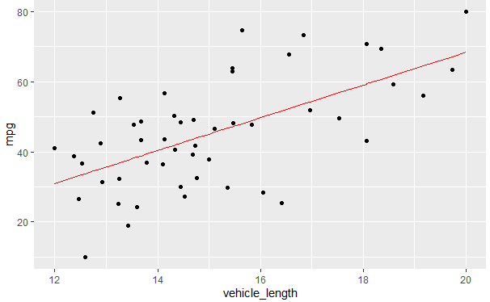
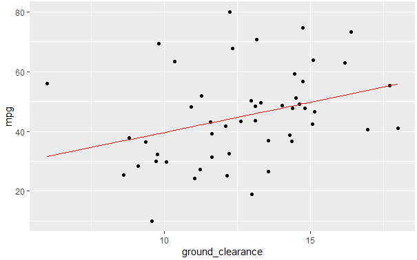

# Automotive Statistical Analysis Using R

## Objective
This project focuses on using the R language to explore the statistical analysis of numerical and categorical datasets for beginners. The analysis includes Statistical modelling, Hypothesis testing and AB testing using a car manufacturing dataset. The details of the tests and results are provided below.

## Linear Regression to Predict Miles Per Gallon(MPG)
The dataset of 50 car prototypes is used to identify ideal vehicle performance by implementing a multiple linear regression model. Multiple metrics, such as vehicle length, vehicle weight, spoiler angle, drivetrain, and ground clearance, were collected for each vehicle. Then using the `lm` function in R, a linear model that predicts the mpg of the car prototypes using the variables listed above was calculated.
 
 

### Summary 
 - Based on the p-values of each variable `vehicle_length` and `ground_clearance` have a statistically significant influence on the MPG performance of the vehicle. The variation of `mpg` with the statically significant variables is shown in the charts below. 
 - The overall low score of the p-values shows that we can reject the null hypothesis that states H0 = the slope of the linear model is zero, or m = 0 
 - The R-squared values of 0.7149 shows that the statically significant variables explain approximately 71% of the variation in the MPG. 
 - The low p-values of the intercept shows that there are other variables not present in the dataset that explain the statical variation in the MPG. This can be variables such as engine type, fuel type etc. 

## Summary Statistics on Suspension Coils
The `Suspension_Coil.csv` dataset contains the results from multiple production lots. In this dataset, the weight capacities of multiple suspension coils were tested to determine if the manufacturing process is consistent across production lots.

### Summary
The design specifications for the MechaCar suspension coils dictate that the variance of the suspension coils must not exceed 100 pounds per square inch. Based on that specification the current current manufacturing data meets this design specification for all manufacturing lots in total but does not meet individually for Lot3. 
 
 

 
*Total Summary*

 
 

 
*Individual Summary*

## T-Tests on Suspension Coils
One-Sample T-Tests were performed to determine if all manufacturing lots and each lot individually are statistically different from the population mean of 1,500 pounds per square inch (PSI).

### Summary 
For this analysis, our hypothesis is as follows: 

H0 : There is no statistical difference between the observed sample mean and its presumed population mean.

Ha : There is a statistical difference between the observed sample mean and its presumed population mean.

1. T-Test for all of the manufacturing lots together shows that the p-value of 0.06028 is higher than our significance level of 0.05 and therefore we fail to reject our null hypothesis.
 
 

2. T-Test for Lot1 PSI data shows that the p-value of 1 is higher than our significance level of 0.05 and therefore we fail to reject our null hypothesis. 
 
 

3. -Test for for Lot2 PSI data show that the p-value of 0.6072 is higher than our significance level of 0.05 and threfore we fail to reject our null hypothesis. 
 
 

4. -Test for all of the manufacturing lots together show that the p-value of 0.04168 is lower than our significance level of 0.05 and therefore we can reject our null hypothesis and conclude that Lot3 sample data is statistically different from the population mean. 
 
 

## Study Design: MechaCar vs Competition
The following analysis can be done to further quantify how the MechaCar(baseline automotive) performs against the competition. 
The statistical study can be performed to test the following:
- Fuel Efficiency, mpg (highway and city) / engine hp
- Cost of the vehicle
- horsepower / vehicle type

#### Statistical Tests
- Merge the competitor data with the MechaCar data and add a categorical field "manufacturer" to filter on using `group_by`. 
- The mpg and cost and hp in all datasets must be numerical, continuous and normally distributed. Also, the variance among each group should be very similar.
- Add a new field for vehicle type example: compact, sedan, SUV, AWD etc. This will be used for the horsepower/vehicle type analysis. 
- Perform two ANOVA analysis for the fuel efficiency (mpg), cost and horsepower for the same type of cars with the following hypothesis: 
H0 : The means of all groups are equal, or µ1 = µ2 = … = µn. 
Ha : At least one of the means is different from all other groups.

#### Inference
- If the Pr(>F) > 0.05 (Significance level) we can state the MechaCar is performing as well as its competitors, but if the Pr(>F) < 0.05 we can conclude that the mean of the metrics for MechaCars is different from its competitors. In such a case we will need to perform a t-test to find out whether the statistical mean for MechaCars is lower or greater than the means of its competitors. 